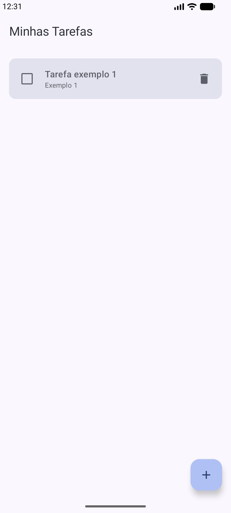
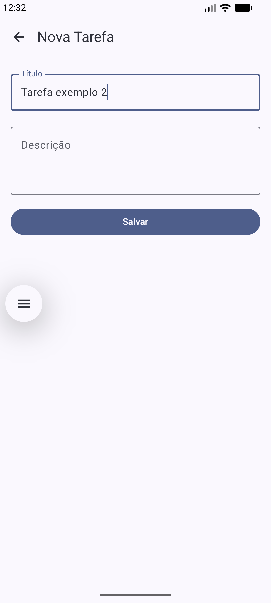
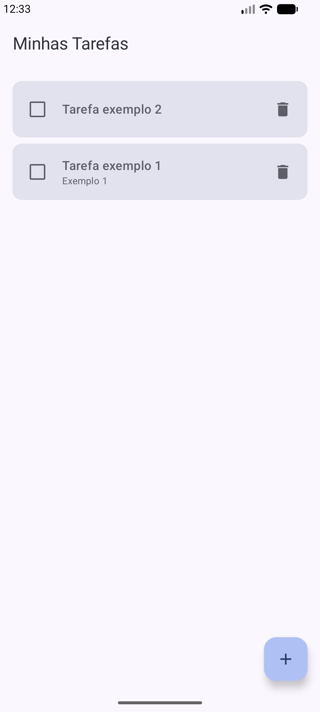
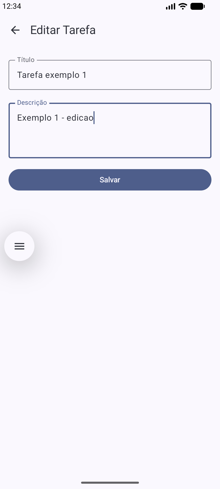
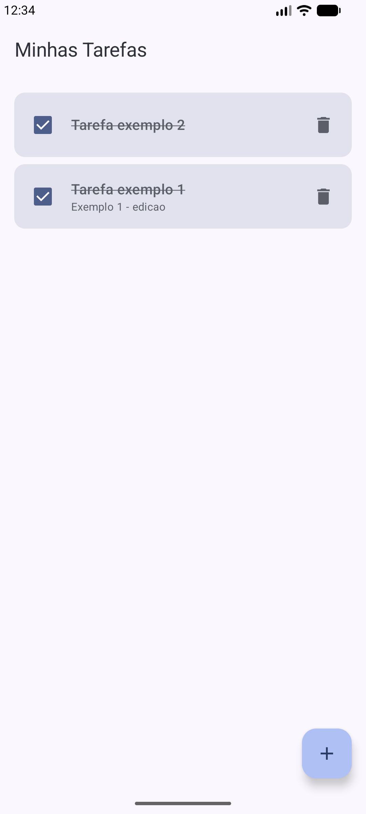
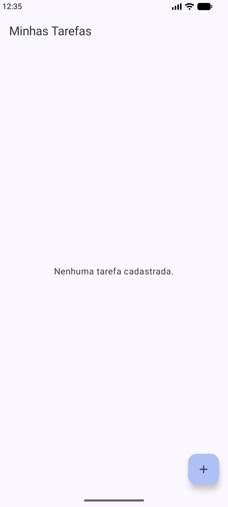
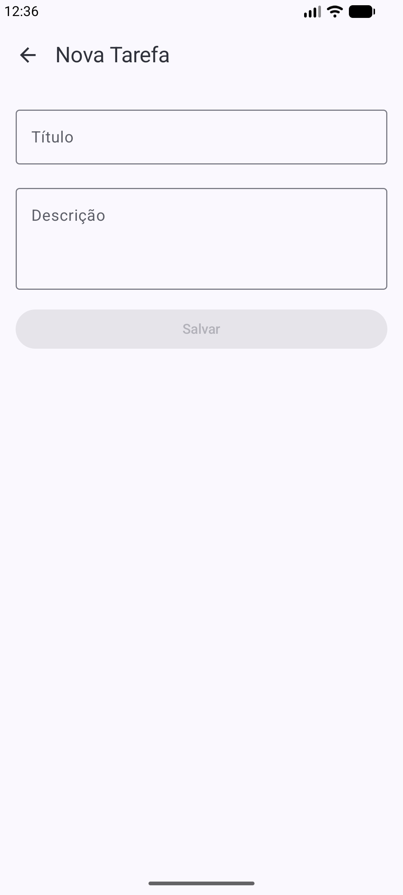
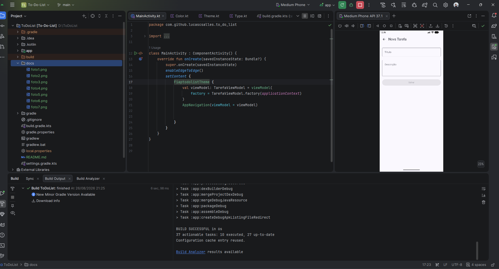

# To-Do List Application

## Descrição do Projeto
Esta é uma aplicação Android nativa de lista de tarefas (To-Do List) desenvolvida como parte de uma atividade prática. O objetivo da aplicação é permitir que o usuário gerencie suas atividades diárias, possibilitando a criação, visualização, edição, marcação de conclusão e exclusão de tarefas.

## Tecnologias Utilizadas
- **Kotlin**: Linguagem de programação oficial para desenvolvimento Android.
- **Jetpack Compose**: Toolkit moderno para construção de UI nativa de forma declarativa.
- **Room**: Biblioteca de persistência que fornece uma camada de abstração sobre o SQLite.
- **Coroutines & Flow**: Utilizados para processamento assíncrono e fluxo de dados reativo entre a base de dados e a interface.
- **ViewModel**: Gerencia os dados relacionados à UI de forma consciente do ciclo de vida.
- **Navigation Compose**: Componente para navegação entre as telas da aplicação.

## Arquitetura e Responsabilidades

### TarefaRepository
O `TarefaRepository` atua como uma camada de abstração sobre o `TarefaDao`. Sua responsabilidade é mediar o acesso aos dados, fornecendo uma interface limpa para o restante do aplicativo. Ele expõe a lista de tarefas como um `Flow<List<Tarefa>>` e fornece funções suspensas para as operações de inserção, atualização e deleção.

### TarefaViewModel
A `TarefaViewModel` é a ponte entre o repositório e a UI. Ela transforma o `Flow` de tarefas em um `StateFlow`, permitindo que a UI observe as mudanças de estado de forma eficiente. Além disso, ela gerencia o `viewModelScope` para executar as operações de banco de dados em threads de segundo plano usando Coroutines.

### ListaTarefasScreen
A `ListaTarefasScreen` observa o estado da lista de tarefas através do método `collectAsStateWithLifecycle()`. Sempre que o banco de dados é atualizado, a UI reage automaticamente. As ações do usuário (como clicar no Checkbox para concluir ou no ícone de lixeira para deletar) são disparadas através de callbacks que chamam as funções correspondentes na `ViewModel`.

### FormularioTarefaScreen
Esta tela é utilizada tanto para cadastro quanto para edição. Ela diferencia os modos através do `tarefaId` recebido via navegação:
- Se `tarefaId == 0`, a tela entra em modo de **Cadastro**, iniciando campos vazios.
- Se `tarefaId != 0`, a tela entra em modo de **Edição**, buscando a tarefa existente na lista para preencher os campos.
Ao salvar, a lógica decide entre `viewModel.inserir()` ou `viewModel.atualizar()` com base no ID.

### AppNavigation e Rotas
As rotas estão configuradas no `AppNavigation` utilizando o `NavHost`:
- `"lista"`: Tela principal com a listagem.
- `"formulario/{tarefaId}"`: Tela de formulário que recebe o ID da tarefa como argumento de navegação.
A passagem do ID permite que a tela de formulário saiba qual tarefa carregar para edição.

### MainActivity
A `MainActivity` é o ponto de entrada da aplicação. Ela configura o `enableEdgeToEdge()` para uma experiência visual moderna, cria a instância da `TarefaViewModel` utilizando uma `Factory` (necessária para passar o contexto ao Database) e inicia o componente de navegação `AppNavigation`.

## Como Executar o Projeto
1. Clone o repositório ou baixe o código fonte.
2. Abra o projeto no **Android Studio (versão Ladybug ou superior)**.
3. Aguarde a sincronização do Gradle.
4. Conecte um dispositivo físico ou inicie um emulador (API 24+).
5. Clique no botão **Run** no Android Studio.

## Seção de Evidências

Abaixo estão as capturas de tela que demonstram as funcionalidades implementadas:

### 1. Execução e Listagem
Tela principal exibindo a lista de tarefas recuperadas do banco de dados.

### 2. Cadastro de Nova Tarefa
Fluxo de preenchimento do formulário para uma nova atividade.

### 3. Tarefa na Lista
Demonstração da tarefa recém-criada aparecendo na listagem principal.

### 4. Edição de Tarefa
Alteração de título ou descrição de uma tarefa já existente.

### 5. Conclusão de Tarefa
Uso do Checkbox para marcar uma tarefa como concluída (estilo riscado).

### 6. Exclusão de Tarefa
Remoção de uma tarefa da lista e do banco de dados.

### 7. Navegação 
Demonstração da transição entre telas e sucesso na compilação do projeto.

### 8. Build
Demonstração da transição entre telas e sucesso na compilação do projeto.

